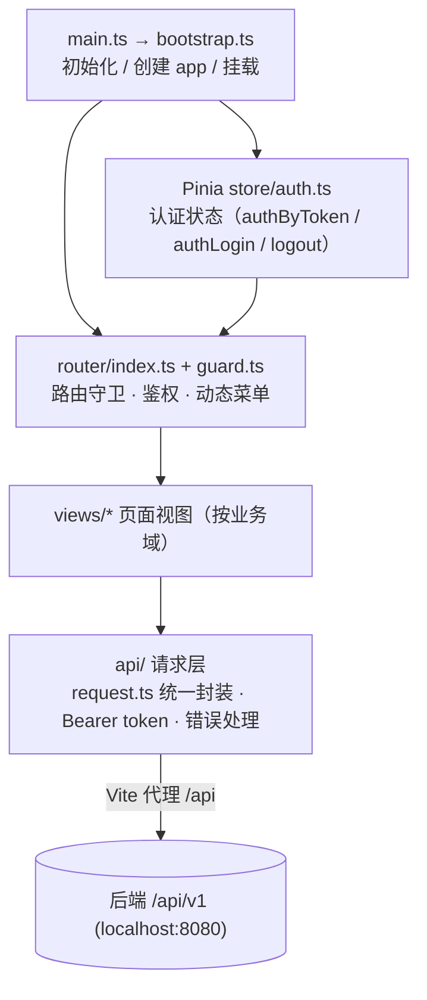
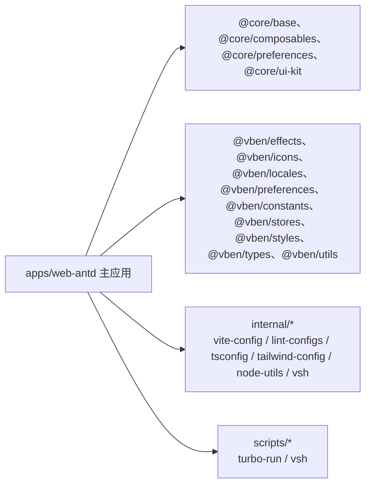

# 03 前端模块职责与关键类

前端为 pnpm + Turbo Monorepo（Vben Admin 5.x）。主应用：`apps/web-antd`（Ant Design Vue 版），核心目录：

```
apps/web-antd/src
├── main.ts / bootstrap.ts / app.vue / preferences.ts   # 入口与引导
├── adapter/          # 组件适配层（form / vxe-table）
├── api/              # 接口请求层（按业务模块分文件，request.ts 统一封装）
├── composables/      # 业务组合式函数（use-mail-auth 等）
├── layouts/          # 布局（basic / auth）
├── router/           # 路由与导航守卫（guard / access）
├── store/            # Pinia（auth.ts 认证状态）
├── utils/            # preference-sync、safe-auth 等
└── views/            # 页面（按业务模块划分）
```



---

## 1. 应用入口与引导

| 文件 | 职责 |
| --- | --- |
| [main.ts](file:///workspace/frontend/apps/web-antd/src/main.ts) | 初始化 preferences → 动态导入 `bootstrap(namespace)` → 移除全局 loading |
| [bootstrap.ts](file:///workspace/frontend/apps/web-antd/src/bootstrap.ts) | 创建 app、注册 Vben 指令/i18n/Pinia stores/路由/权限指令/Motion 并挂载 `#app` |
| [app.vue](file:///workspace/frontend/apps/web-antd/src/app.vue) | 根组件：`ConfigProvider` + `App` 包裹 `RouterView` |
| [preferences.ts](file:///workspace/frontend/apps/web-antd/src/preferences.ts) | 项目级偏好覆盖：`accessMode:'backend'`、`defaultHomePath:'/overview/monitor'`、`enableRefreshToken:false` |
| [vite.config.ts](file:///workspace/frontend/apps/web-antd/vite.config.ts) | 开发代理 `/api` → `localhost:8080`、`/ws` → WebSocket |

## 2. 路由与权限

| 文件 | 职责 |
| --- | --- |
| [router/index.ts](file:///workspace/frontend/apps/web-antd/src/router/index.ts) | 创建 `Router` 实例 + 配置历史模式 + 初始化守卫 |
| [router/guard.ts](file:///workspace/frontend/apps/web-antd/src/router/guard.ts) | 核心权限守卫：校验 accessToken、生成用户菜单/路由、处理"待激活"页、登录后重定向目标页 |
| [router/access.ts](file:///workspace/frontend/apps/web-antd/src/router/access.ts) | 访问控制 / 路由过滤 |

## 3. 状态管理（Pinia）

| 文件 | 职责 |
| --- | --- |
| [store/auth.ts](file:///workspace/frontend/apps/web-antd/src/store/auth.ts) | `authByToken`（写 token + 拉用户）、`authLogin`（登录）、`logout`（登出 + 重置 stores + 回登录页） |

## 4. 接口请求层

### 统一请求封装 [api/request.ts](file:///workspace/frontend/apps/web-antd/src/api/request.ts)
- `doRefreshToken()`：token 刷新逻辑（受 `enableRefreshToken` 开关控制）。
- 请求拦截：自动注入 `Authorization: Bearer <token>`。
- 响应拦截：按 code 统一错误处理 + token 过期处理。
- 后端接口经 Vite 代理转发至 `localhost:8080`。

### 业务 API 文件（`src/api/` 顶层）
| 文件 | 主要导出函数 / 用途 |
| --- | --- |
| [core/auth.ts](file:///workspace/frontend/apps/web-antd/src/api/core/auth.ts) | `loginApi`、`safeApi`、`getMailEnabledApi`、`sendMailCodeApi`、`getClickCaptchaApi`、`verifyClickCaptchaApi`、`checkUsernameApi`、`mailLoginApi`、注册/刷新/登出/二级认证等 |
| [core/oauth.ts](file:///workspace/frontend/apps/web-antd/src/api/core/oauth.ts) | `getOAuthProvidersApi`、`getOAuthAuthorizeApi`、`oauthLoginApi`、`oauthBindApi`、`getOAuthBindingsApi`、`unbindOAuthApi` |
| [system/user.ts](file:///workspace/frontend/apps/web-antd/src/api/system/user.ts) | 用户分页/详情/角色/CRUD：`getUserPageApi`、`getUserRoleIdsApi`、`createUserApi`... |
| [system/role.ts](file:///workspace/frontend/apps/web-antd/src/api/system/role.ts) | `getRolePageApi`、`getRoleMenuIdsApi`、`createRoleApi`... |
| [system/menu.ts](file:///workspace/frontend/apps/web-antd/src/api/system/menu.ts) | `getMenuTreeApi`、`createMenuApi`... |
| [system/dict.ts](file:///workspace/frontend/apps/web-antd/src/api/system/dict.ts) | 字典类型/数据：`getDictTypePageApi`、`getDictDataByTypeApi`... |
| [system/config.ts](file:///workspace/frontend/apps/web-antd/src/api/system/config.ts) | `getConfigPageApi`、`createConfigApi`... |
| [system/log.ts](file:///workspace/frontend/apps/web-antd/src/api/system/log.ts) | `getAuditLogPageApi`、`getLoginLogPageApi` |
| [system/quick-nav.ts](file:///workspace/frontend/apps/web-antd/src/api/system/quick-nav.ts) | 快捷导航 CRUD |
| [monitor.ts](file:///workspace/frontend/apps/web-antd/src/api/monitor.ts) | 监控：`getMetricFrameApi` 等 |
| [file.ts](file:///workspace/frontend/apps/web-antd/src/api/file.ts) | 文件列表、上传下载、内容读写、权限、压缩解压、删除、回收站 |
| [ops.ts](file:///workspace/frontend/apps/web-antd/src/api/ops.ts) | 进程/服务/防火墙通用运维接口 + 宿主通道能力 `hostCapabilityApi` |
| [server-config.ts](file:///workspace/frontend/apps/web-antd/src/api/server-config.ts) | 服务器配置（对应后端 `ServerConfigController`，`ops:config:*` 权限） |
| [nginx.ts](file:///workspace/frontend/apps/web-antd/src/api/nginx.ts) | Nginx 实例/站点/upstream/stream/证书/日志/变更回滚（函数如 `getNginxSitePageApi`、`issueNginxCertApi`、`rollbackNginxChangeApi`...） |
| [appstack.ts](file:///workspace/frontend/apps/web-antd/src/api/appstack.ts) | Docker（`getContainerListApi`、`pullImageApi`）、MySQL（`createDatabaseApi`、`backupDatabaseApi`）、取号（`getIdSourcePageApi`、`probeIdSourceApi`） |
| [job.ts](file:///workspace/frontend/apps/web-antd/src/api/job.ts) / [job-log.ts](.../job-log.ts) | 任务调度中心 / 任务日志 |
| [base-data.ts](file:///workspace/frontend/apps/web-antd/src/api/base-data.ts) | 基础数据：行政区划、手机号段、银行卡 BIN、同步 |
| [dashboard.ts](file:///workspace/frontend/apps/web-antd/src/api/dashboard.ts) | 仪表盘 |
| [preference.ts](file:///workspace/frontend/apps/web-antd/src/api/preference.ts) | `getUserPreferenceApi` / `saveUserPreferenceApi` |
| [tools.ts](file:///workspace/frontend/apps/web-antd/src/api/tools.ts) | 工具箱（加解密/混淆/二维码/JWT/正则/图片转换/证书） |

## 5. 页面视图（src/views）

按业务域组织：

| 目录 | 页面/要点 |
| --- | --- |
| [dashboard/index.vue](file:///workspace/frontend/apps/web-antd/src/views/dashboard/index.vue) | 仪表盘 |
| [monitor/index.vue](file:///workspace/frontend/apps/web-antd/src/views/monitor/index.vue) | 实时监控曲线（调用 `getMetricFrameApi`） |
| [file/index.vue](file:///workspace/frontend/apps/web-antd/src/views/file/index.vue) | 文件管理器 |
| [ops/service](file:///workspace/frontend/apps/web-antd/src/views/ops/service/index.vue) | systemd 服务（含 `ServiceDetailDrawer`、`ServiceLogPanel`） |
| [ops/process](file:///workspace/frontend/apps/web-antd/src/views/ops/process/index.vue) | 进程管理 |
| [ops/firewall](file:///workspace/frontend/apps/web-antd/src/views/ops/firewall/index.vue) | 防火墙（含 `WatchdogBar`、`ChangeHistoryDrawer`、`RuleFormModal`） |
| [ops/nginx](file:///workspace/frontend/apps/web-antd/src/views/ops/nginx/index.vue) | Nginx（站点/upstream/stream/证书/回滚，多个 Drawer 组件） |
| [ops/server-config](file:///workspace/frontend/apps/web-antd/src/views/ops/server-config/index.vue) | 服务器配置（ApplyPreviewModal / ChangeHistoryDrawer / DangerConfirmModal / ItemFormModal） |
| [ops/components/HostChannelBanner.vue](file:///workspace/frontend/apps/web-antd/src/views/ops/components/HostChannelBanner.vue) | 三页共用：通道状态展示 + 安装指引 + 只读降级 |
| [appstack/docker](file:///workspace/frontend/apps/web-antd/src/views/appstack/docker/index.vue) / [appstack/database](.../database/index.vue) | 容器/镜像、MySQL 数据库 |
| [appstack/job](file:///workspace/frontend/apps/web-antd/src/views/appstack/job/index.vue) / [job-log](.../job-log/index.vue) | 任务调度 / 任务日志 |
| [system/*](file:///workspace/frontend/apps/web-antd/src/views/system/user/index.vue) | user / role / menu / dict / config / audit-log / login-log / basedata / quick-nav |
| [tools/*](file:///workspace/frontend/apps/web-antd/src/views/tools/crypto/index.vue) | 加解密、混淆、二维码、JWT、正则、图片转换、ID、证书解析、URL 编解码 等工具箱页面 |
| [_core/](file:///workspace/frontend/apps/web-antd/src/views/_core/) | Vben 框架核心页：`authentication`（login/register/code-login/oauth-callback/forget-password/验证码组件）、`profile`（base/security/password/oauth/notification）、`fallback`（404/500/403/offline/coming-soon）、`about` |

## 6. 组合式函数与工具

| 文件 | 职责 |
| --- | --- |
| [composables/use-mail-auth.ts](file:///workspace/frontend/apps/web-antd/src/composables/use-mail-auth.ts) | 邮箱登录/注册逻辑 |
| [composables/use-mail-captcha.ts](file:///workspace/frontend/apps/web-antd/src/composables/use-mail-captcha.ts) | 邮箱验证码倒计时/发送 |
| [composables/use-oauth.ts](file:///workspace/frontend/apps/web-antd/src/composables/use-oauth.ts) | 第三方 OAuth 登录流程 |
| [utils/preference-sync.ts](file:///workspace/frontend/apps/web-antd/src/utils/preference-sync.ts) | 用户偏好同步后端 |
| [utils/safe-auth.ts](file:///workspace/frontend/apps/web-antd/src/utils/safe-auth.ts) | 敏感信息安全处理（脱敏/清除等） |

## 7. 布局

| 文件 | 职责 |
| --- | --- |
| [layouts/basic.vue](file:///workspace/frontend/apps/web-antd/src/layouts/basic.vue) | 登录后主框架布局 |
| [layouts/auth.vue](file:///workspace/frontend/apps/web-antd/src/layouts/auth.vue) | 认证页布局 |

## 8. Monorepo 内部包（frontend/packages 与 internal）

`apps/web-antd` 之上的共享能力，采用 pnpm workspace + catalog 版本收敛：



| 包 | 作用 |
| --- | --- |
| `@core/base/*` | 基础：design(设计变量)、icons、shared、typings |
| `@core/composables` | 通用组合式函数（use-namespace、use-sortable、use-scroll-lock...） |
| `@core/preferences` | 偏好/配置系统（config / preferences / use-preferences / update-css-variables） |
| `@core/ui-kit/*` | form-ui / layout-ui / menu-ui / popup-ui / tabs-ui / shadcn-ui 组件 kit |
| `@vben/effects/*` | access(权限)/common-ui/hooks/layouts/plugins/request 等框架注入层 |
| `@vben/icons` | 图标（iconify + svg） |
| `@vben/locales` | i18n |
| `@vben/preferences` / `@vben/constants` / `@vben/stores` / `@vben/styles` / `@vben/types` / `@vben/utils` | 通用常量/状态/样式/类型/工具 |
| `internal/*`（vite-config、lint-configs、tsconfig、node-utils、tailwind-config、vsh） | 工程化配置与工具链 |
| `scripts/*`（turbo-run、vsh） | 构建编排与校验脚本 |

> 说明：`apps/backend-mock`（Nitro）提供本地接口 Mock 供开发联调；`apps/docs`（VitePress）为文档站。