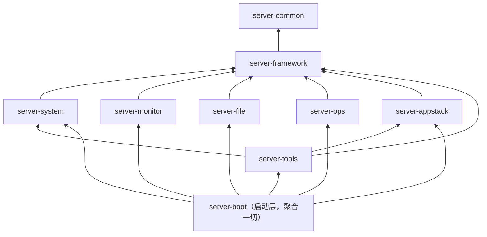
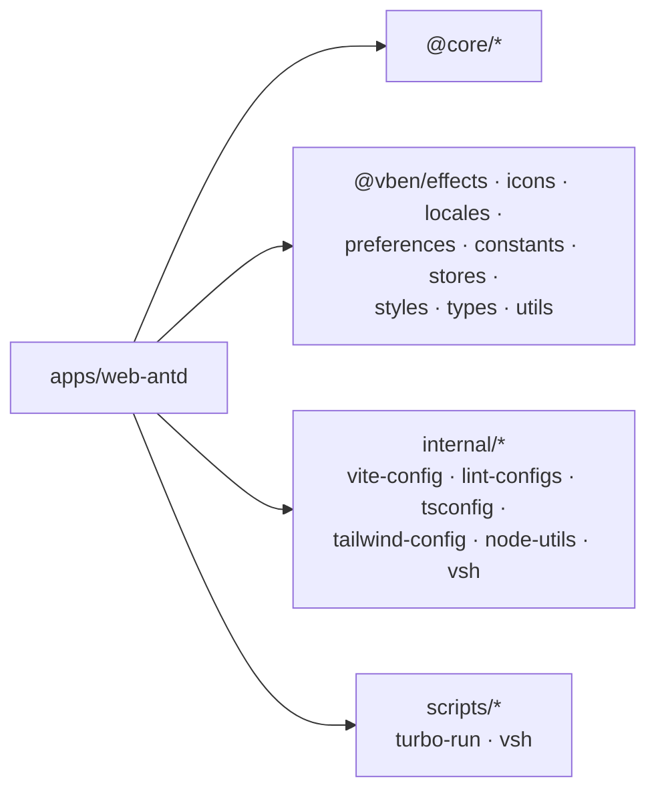

# 05 依赖关系

## 1. 后端模块依赖拓扑

模块依赖单向（箭头 = "依赖"），禁止反向/成环：

- 根聚合：[backend/pom.xml](file:///workspace/backend/pom.xml)（version 1.0.0，`dependencyManagement` 收敛第三方版本）。
- 启动装配：[server-boot/pom.xml](file:///workspace/backend/server-boot/pom.xml)（finalName `serverpanel`）。
- `server-tools`：依赖 `server-framework` + `server-system` + `server-appstack`，见 [server-tools/pom.xml](file:///workspace/backend/server-tools/pom.xml)。
- `server-appstack`：额外依赖 docker-java、postgresql 驱动，见 [server-appstack/pom.xml](file:///workspace/backend/server-appstack/pom.xml)。

## 2. 后端第三方依赖（版本收敛于根 POM）

| 三方库 | 版本 | 用途 |
| --- | --- | --- |
| Spring Boot | 4.1.1 | 核心框架（starter-parent） |
| MyBatis-Plus（spring-boot4-starter + jsqlparser） | 3.5.17 | ORM + 分页 |
| Druid | 1.2.28 | 连接池 |
| Sa-Token（spring-boot4 + redis-jackson） | 1.46.0 | 认证授权 |
| OSHI | 7.6.1 | 系统指标采集 |
| docker-java（core + httpclient5） | 3.7.1 | Docker 客户端 |
| springdoc-openapi-starter-webmvc-ui | 3.1.1 | OpenAPI / Swagger |
| commons-compress | 1.28.0 | 压缩解压（tar.gz） |
| ip2region | 2.7.0 | IP 离线归属地 |
| ZXing | 3.5.3 | 二维码 |
| TwelveMonkeys imageio | 3.12.0 | 图片格式转换（JPEG/TIFF/WebP） |
| JustAuth | 1.16.7 | 第三方 OAuth 登录 |
| Spotless | 3.10.2 | 代码格式化（palantirJavaFormat） |
| PostgreSQL JDBC | SB4 BOM | 取号数据源 nextval |
| Lombok / Flyway / FreeMarker / cron-utils / websocket / aspectj | SB4 BOM 管理 | 基建 |

## 3. 前端技术栈（frontend/）

| 组件 | 版本 | 用途 |
| --- | --- | --- |
| Node.js | 24.16（engines ^22.18 ‖ ^24.12） | 运行环境 |
| pnpm | 11.16 | 包管理（workspace + catalog） |
| Turbo | 2.10.12 | 构建编排 |
| Vue | 3.5.40 | 框架 |
| Vite | 8.2.2 | 构建 |
| Pinia（+persistedstate） | 4.0.2 | 状态管理 |
| Ant Design Vue | 4.2.6 | UI 组件库（web-antd） |
| VXE-Table / vxe-pc-ui | 4.21.2 / 4.17.18 | 表格方案 |
| TypeScript | 6.0.3 | 类型 |
| axios（@vben/request） | 1.18.1 | HTTP |
| @tanstack/vue-query | 5.102.3 | 服务端状态 |
| dayjs | 1.21.11 | 日期 |
| @tiptap | 3.30.3 | 富文本 |
| echarts | 6.1.0 | 图表 |
| Tailwind CSS | 4.3.3 | 样式 |
| Vitest / Playwright | 4.1.11 / 1.62.1 | 单元/E2E 测试 |

## 4. 前端 Monorepo 内部依赖

## 5. 基础设施依赖（docker/ 与 docker-compose.dev.yml）

- MySQL 8.4：面板库 `server_panel`，账号 `panel/Panel@123456`。
- Redis 7。
- 初始化脚本 [docker/mysql-init/01-flyway-grants.sql](file:///workspace/docker/mysql-init/01-flyway-grants.sql) 为 Flyway 迁移账号授权。
- 生产依赖：JDK 21、MySQL 8.x、Redis 6+，可选 Docker（容器管理）/ mysqldump（数据库备份）、宿主机 nginx + psm-hostagent（运维能力）。

## 6. 存储分工

| 存储 | 承载 |
| --- | --- |
| MySQL | RBAC（用户/角色/菜单/字典/配置/日志）、Nginx、防火墙、文件回收站、Docker/数据库元数据、任务与取号等业务表（Flyway 迁移） |
| Redis | Sa-Token 会话、缓存、验证码、防爆破计数 |
| MongoDB | 监控历史聚合、服务器配置（drop-in）、操作变更审计（OpsNginxChange / OpsServerConfigChange）、用户偏好 |

## 7. Flyway 迁移脚本清单

位于 `backend/server-boot/src/main/resources/db/migration`，共 23 个版本（`V1` ~ `V23`）：

- `V1__init.sql` — 初始建表
- `V2__add_sys_user_desc.sql`、`V3__add_monitor_menu.sql`、`V4__quick_nav_and_overview.sql`、`V5__add_sys_user_gender_avatar.sql` — 增量字段/菜单
- `V6__ops_module_refactor.sql` — 运维模块重构
- `V7__drop_duplicate_cron_index.sql`、`V8__nginx_module.sql`、`V9__server_config_module.sql`
- `V10__drop_cron_and_website_modules.sql`、`V11__job_scheduler_module.sql`
- `V12__audit_log_biz_code_and_risky.sql` — 审计字段
- `V13__tools_module.sql` ... `V15__id_generator_menu.sql`、`V16__id_source.sql`、`V17__quick_nav_domain_https.sql` ... `V22__user_oauth_binding.sql`、`V23__email_login_and_register.sql` — 工具箱/取号/OAuth/邮箱等增量