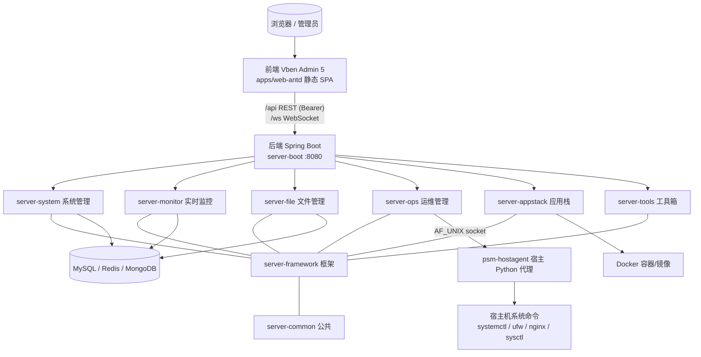

# ServerPanel Code Wiki — 项目代码知识库

> 面向开发者与维护者的结构化代码文档。基于当前仓库**真实代码**分析整理，覆盖整体架构、模块职责、关键类与函数、依赖关系、运行方式。
>
> 项目：**ServerPanel 个人服务器管理系统**（类宝塔面板的单机 Linux 服务器可视化管理系统）
> 主体：**Java 21 + Spring Boot 4.1** 后端 + **Vue 3 + Vben Admin 5** 前端，前后端一体化部署（单 fat jar 同时承载页面与 API）。

---

## 文档导航

| 文档 | 内容 |
| ---- | ---- |
| [01 整体架构](01-architecture.md) | 系统定位、前后端架构、请求链路、认证授权、关键设计机制、宿主执行通道总览 |
| [02 后端模块职责与关键类](02-backend-modules.md) | 后端 9 个 Maven 模块职责、分层规范、每个模块的 Controller/Service/核心类清单与职责 |
| [03 前端模块职责与关键类](03-frontend-modules.md) | web-antd 应用入口、路由权限、状态、接口层、页面视图、Monorepo 内部包 |
| [04 宿主执行通道 psm-hostagent](04-host-channel.md) | 为什么需要宿主通道、Python agent 设计、操作白名单、后端接入、部署 |
| [05 依赖关系](05-dependencies.md) | 后端模块依赖拓扑、第三方依赖版本、前端 Monorepo 内部包依赖、技术栈版本矩阵 |
| [06 运行与构建](06-build-and-run.md) | 开发环境启动、生产构建、部署、Flyway 迁移、验证冒烟清单 |

---

## 快速概览



```
┌─────────────────────────────────────────────────────────────┐
│                    浏览器 / 管理员用户                         │
└───────────────┬─────────────────────────┬───────────────────┘
                │   前端 Vben Admin 5      │   WebSocket /ws
                │   (apps/web-antd)        │
                │   /api (REST, Bearer)    ▼
        ┌───────▼─────────────────────────────────────────────┐
        │            后端 Spring Boot (server-boot, :8080)      │
        │  ┌──────────┬──────────┬──────────┬────────────────┐ │
        │  │ system   │ monitor  │ file     │ ops  │appstack │ │
        │  │ 系统管理  │ 实时监控  │ 文件管理  │ 运维 │ 应用栈   │ │
        │  │ tools 工具│          │          │      │         │ │
        │  └──────────┴──────────┴──────────┴────────────────┘ │
        │       framework（框架）/ common（公共）越过下层         │
        └───────┬──────────┬──────────┬──────────┬────────────┘
                │          │          │          │
           MySQL/Redis   MongoDB   Docker   AF_UNIX socket
                                      │          ▼
                                 psm-hostagent 宿主 Python agent
```

- **后端**：单体多模块 Maven 工程，`server-boot` 装配全部业务模块启动。
- **前端**：pnpm + Turbo Monorepo，主应用 `apps/web-antd`（Ant Design Vue 版）。
- **宿主通道**：容器内无法执行的系统管理命令，经 `psm-hostagent` 在宿主机代理执行（服务/防火墙/Nginx/系统配置）。

---

## 约定

- 文中类名/函数名对应真实源码，点击链接可直达（`file:///` 格式）。
- 文档语言为简体中文，与技术栈保持一致；术语（如 Controller / Service / Token）保留英文。